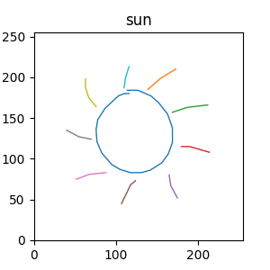
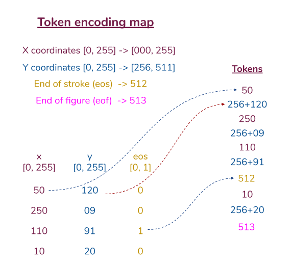
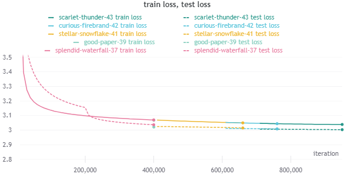

# sketch-transformer
Modeling Draw, Quick! dataset using transformers.

## Train model
    $ python train.py --on-memory-dataset

## Pretrained model

A pretrained model (`test llh: 3.002`) is at `assets/model_1000000.pt`

`$ python train.py --num-transformer-layers=8 --dropout-rate=0.1 --batch-size=128 --learning-rate=1e-3 --on-memory-dataset --log-freq=10000`

## Generate sample

    $ python generate.py --nucleus-probability=0.5 --category=car --checkpoint=[path/to/checkpoint.pt]